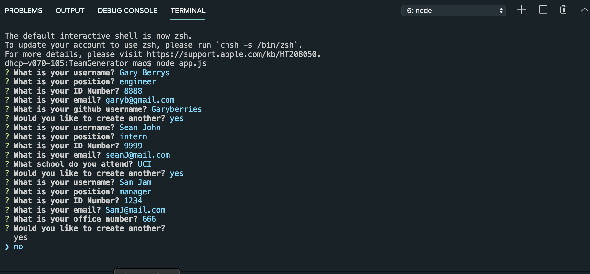
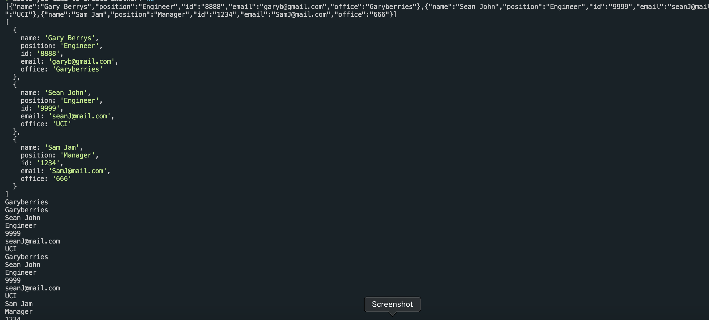
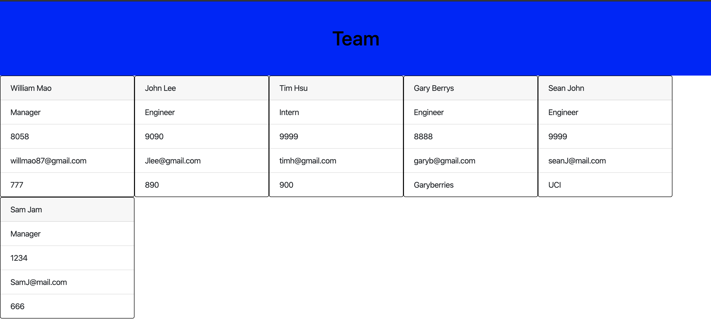

# TeamGenerator

This is a team generator that allows the user to input data on mulitple peoples, then it will give the data output as cards. There are three different profiles to select : Engineer, Intern, Manager.
Run the app using node, after the data is inserted it will display them as cards in browser.

